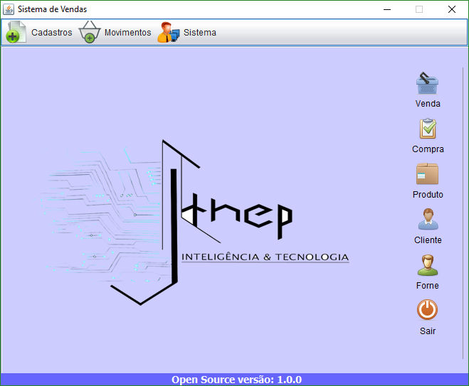
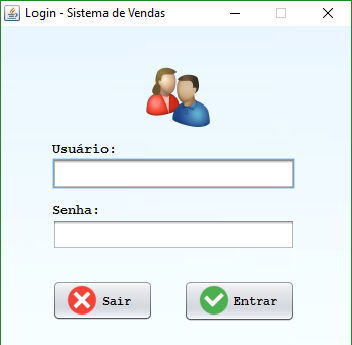

<h1>Pequeno-Sistema-de-Vendas-Java</h1>

Aplicação desenvolvida como material de apoio ao aprendizado de programação Java usando o pacote Swing. É fornecida gratuitamente.

Softwares utilizados:
  <ul>
    <li>JDK - 11</li>
    <li>NetBeans IDE 8.1</li>
    <li>MySQL Server 5.1.53-community</li>
    <li>MySQL Connector JDBC 5.1.23</li>
    <li>MySQL Workbench</li> 
    <li>Windows 10</li>
    <li>Enterprise Architect Trial</li>
  </ul>

<h3> Acesso ao Sistema</h3>

<b>Usuario: adm</b>

<b>Senha: 123</b>

Pré Visualização

Esses foi meu primeiro programa java - Não irei continua pois estou fazendo um outro bem mais elaborado em Web.

